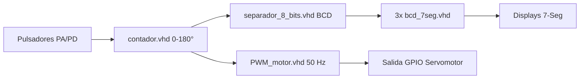
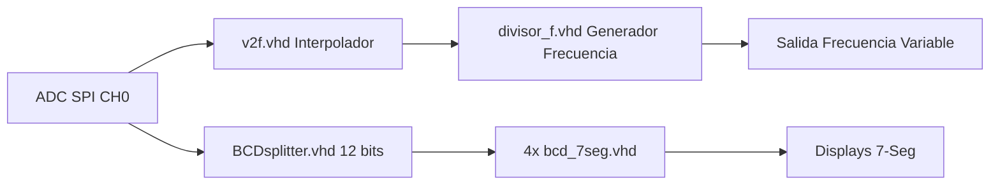

# ⚙️ Arquitectura RTL Jerárquica en VHDL para FPGA (DE1-SoC Cyclone V)

[](LICENSE)
[]()
[]()
[]()

Diseño e implementación de dos sistemas digitales en hardware reconfigurable (VHDL) sobre la tarjeta FPGA **DE1-SoC (Intel/Altera Cyclone V)** utilizando un enfoque jerárquico modular mediante paquetes de componentes reusable.

---

## 👥 Autores / Integrantes
* **Juan Manuel Gonzalez Banguero**
* **Luis José Pinto Gonzalez**
* **Andres David Nazarith Gomez**

---

## 📌 Descripción de los Sistemas

El repositorio integra dos aplicaciones completas desarrolladas a nivel de transferencia de registros (RTL):

### 1. Control de Posición de Servomotor con Displays 7-Segmentos (Lab 2)
* **Funcionalidad:** Permite la selección interactiva de un ángulo ($0^\circ - 180^\circ$ en pasos de $10^\circ$) mediante pulsadores físicos con detector de flancos activo-bajo.
* **Visualización:** Descompone el valor entero en dígitos BCD y lo proyecta en 3 displays de 7 segmentos.
* **Generador PWM:** Produce una onda cuadrada a $50\,\text{Hz}$ con ancho de pulso dinámico (entre $0.5\,\text{ms}$ para $0^\circ$ y $3.2\,\text{ms}$ para $180^\circ$) sobre un reloj maestro de $50\,\text{MHz}$.

### 2. Conversor Voltaje-a-Frecuencia y FSM con ADC (Tarea ADC)
* **Funcionalidad:** Comunicación con el ADC integrado de la tarjeta mediante protocolo serie SPI.
* **Mapeo V-to-F:** Interpola el valor leido de 12 bits ($0 - 4095$) a una frecuencia proporcional ($1\,\text{kHz} - 100\,\text{kHz}$).
* **Detector FSM:** Máquina de estados finitos tipo **Moore** de 5 estados para la detección de la secuencia binaria `0110` con solapamiento (*overlapping*).

---

## 🏗️ Arquitectura del Sistema (Diagramas RTL)

### Módulo Control de Servomotor


### Módulo Conversor V-to-F y ADC


---

## 💻 Estructura del Repositorio

```
03_Arquitectura_RTL_VHDL_FPGA_DE1SoC/
├── README.md
├── .gitignore
└── rtl/
    ├── packages/
    │   └── Componentes.vhd           # Declaración de componentes reutilizables
    ├── servomotor_control/
    │   ├── contador.vhd              # Contador 0-180° con filtro de flancos
    │   ├── PWM_motor.vhd             # Generador PWM 50 Hz parametrizado
    │   ├── separador_8_bits.vhd      # Conversor Binario a BCD de 8 bits
    │   ├── bcd_7seg.vhd              # Decodificador BCD a 7 Segmentos (Activo Bajo)
    │   └── TopLevel_Servo.vhd        # Entidad Estructural de Nivel Superior
    ├── adc_v2f/
    │   ├── v2f.vhd                   # Conversor lineal Voltaje-a-Frecuencia
    │   ├── divisor_f.vhd             # Divisor de frecuencia genérico (Generics)
    │   ├── BCDsplitter.vhd           # Separador síncrono BCD de 12 bits
    │   └── Detector_secuencia_FSM.vhd # FSM Moore de 5 estados (Detecta '0110')
    └── basic_blocks/
        ├── half_adder.vhd            # Medio sumador RTL
        ├── full_adder.vhd            # Sumador completo estructural
        └── flip_flop_JK.vhd          # Flip-Flop JK síncrono
```

---

## 📐 Ecuaciones de Diseño VHDL

### Generador PWM ($50\text{ Hz} @ 50\text{ MHz}$)
* **Período Total ($N$):** $\frac{50\text{ MHz}}{50\text{ Hz}} = 1000000$ ciclos de reloj.
* **Pulso Mínimo ($0^\circ$):** $0.5\text{ ms} = 25000$ ciclos.
* **Pulso Máximo ($180^\circ$):** $3.2\text{ ms} = 160000$ ciclos.
* **Fórmula de Duración:**
    $$
    N_{\text{high}} = \text{Pulso}_{\text{min}} + \frac{(\text{Pulso}_{\text{max}} - \text{Pulso}_{\text{min}}) \times \text{entrada}}{255}
    $$

---

## 🛠️ Herramientas y Compilación

* **Hardware Target:** FPGA Intel Cyclone V (DE1-SoC / 5CSEMA5F31C6).
* **Entorno de Desarrollo:** Intel Quartus Prime Standard / Lite Edition.
* **Lenguaje:** VHDL IEEE 1076-1993 / 2002.

### Pasos para Síntesis en Quartus Prime
1. Crear un proyecto nuevo seleccionado la tarjeta Cyclone V `5CSEMA5F31C6`.
2. Incluir los archivos VHDL ubicados en la carpeta `rtl/`.
3. Asignar la entidad `TopLevel_Servo` o `FullADCview` como Top-Level Entity.
4. Asignar los pines físicos (Pin Planner) para el reloj de $50\,\text{MHz}$ (`CLOCK_50`), botones (`KEY`) y displays (`HEX0`-`HEX3`).
5. Ejecutar la compilación completa (*Start Compilation*) y programar la tarjeta vía USB-Blaster II.

---

## 📄 Licencia

Este proyecto está liberado bajo la Licencia MIT.
